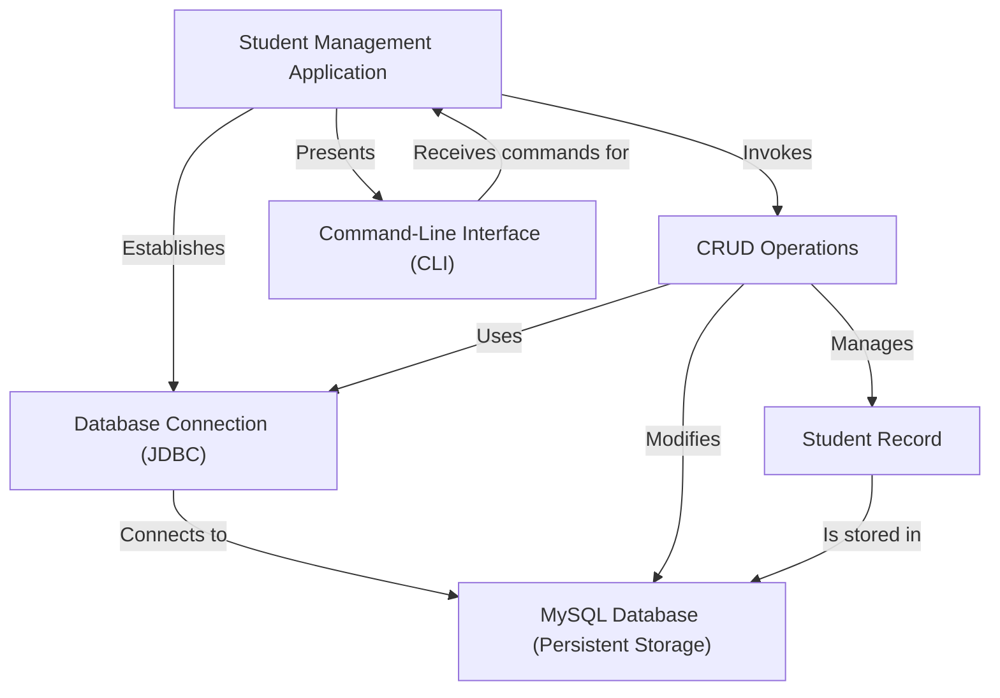
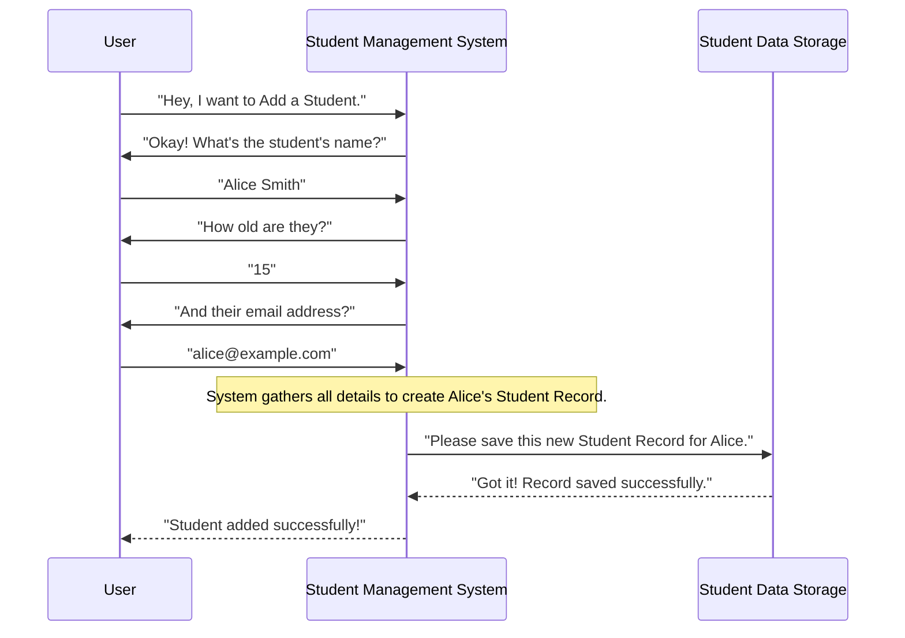
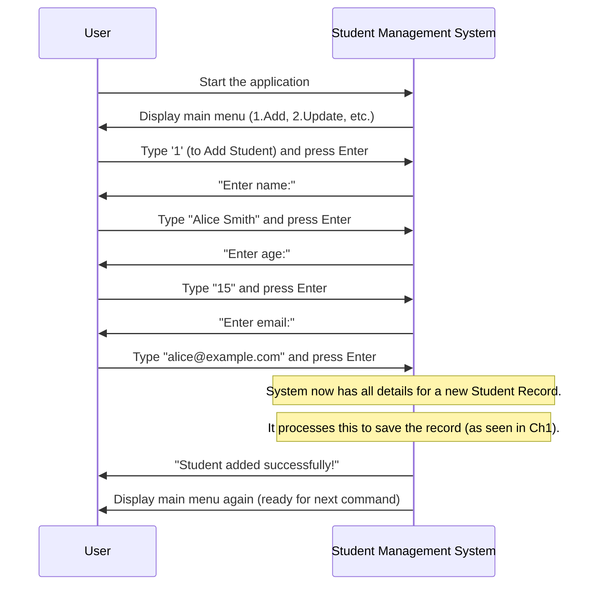
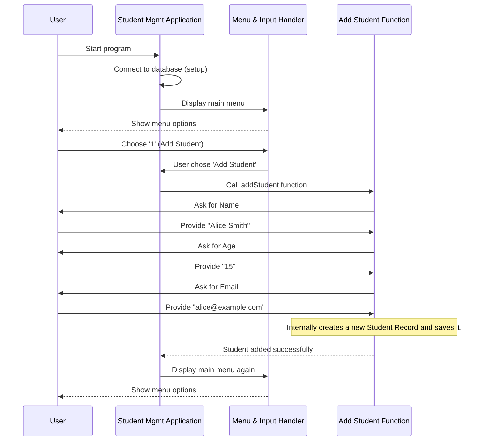
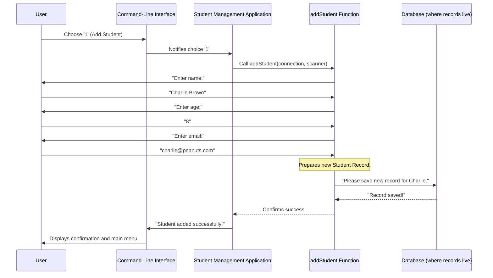
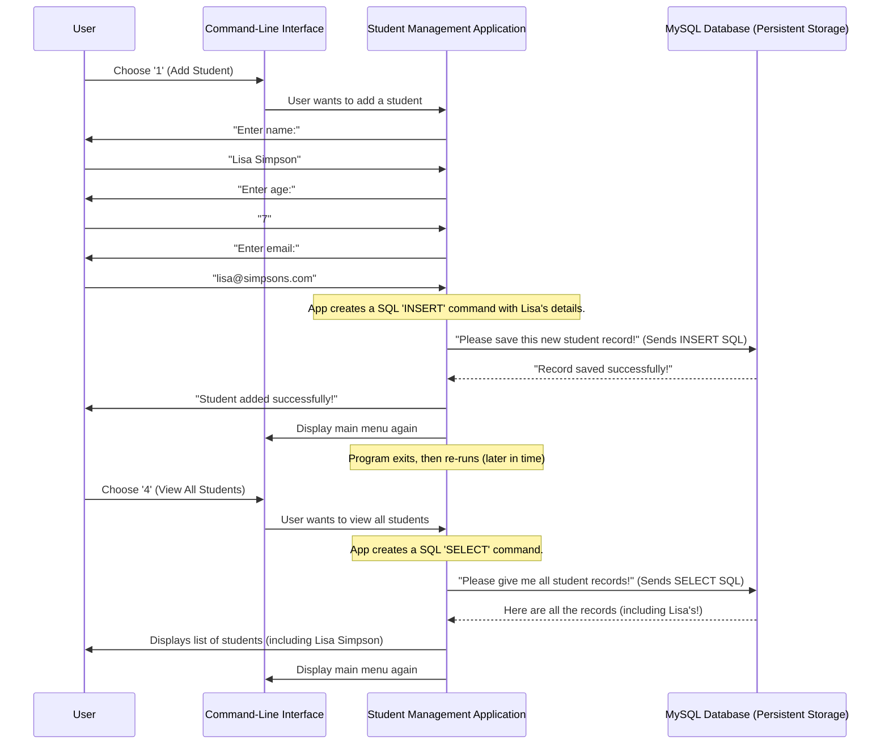
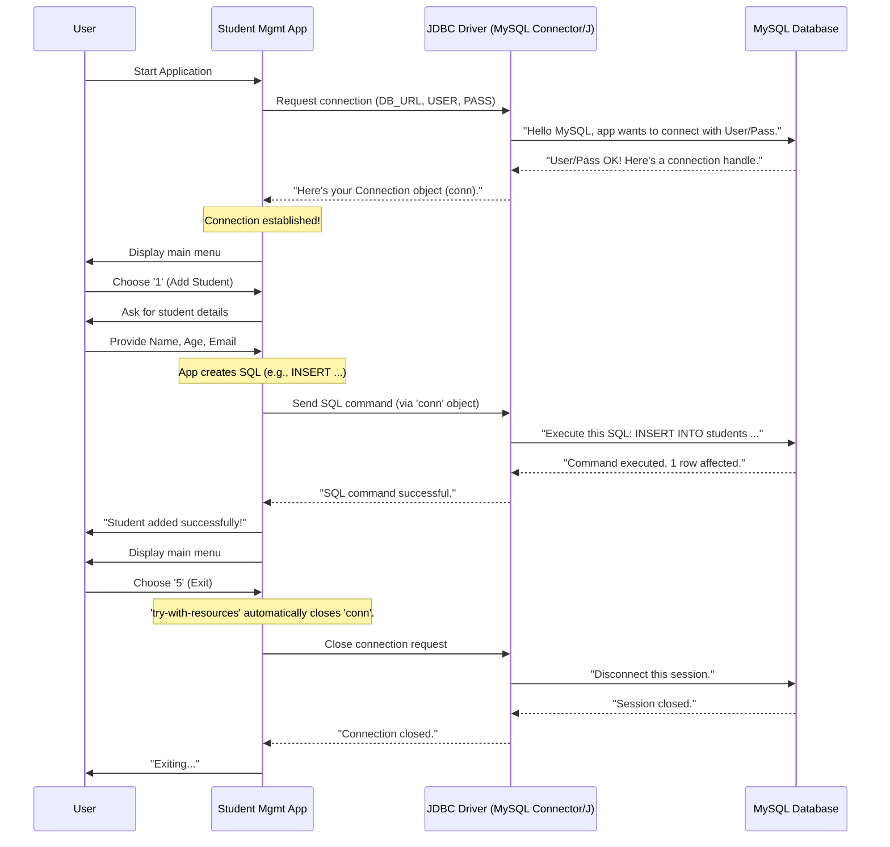

# Tutorial: studentmanagmentsystem

This project is a simple **Student Management System** built with *Java* and *MySQL*. It allows users to manage student information through a *command-line interface (CLI)*. Users can perform fundamental *CRUD operations* (Create, Read, Update, Delete) on student records, which are stored persistently in a *MySQL database* via *JDBC connectivity*.


## Visual Overview



## Chapters

1. [Student Record
](01_student_record_.md)
2. [Command-Line Interface (CLI)
](02_command_line_interface__cli__.md)
3. [Student Management Application
](03_student_management_application_.md)
4. [CRUD Operations
](04_crud_operations_.md)
5. [MySQL Database (Persistent Storage)
](05_mysql_database__persistent_storage__.md)
6. [Database Connection (JDBC)
](06_database_connection__jdbc__.md)

---
# Chapter 1: Student Record

Welcome to the very first chapter of our tutorial on the `Student Management System`! If you're new to programming or databases, don't worry – we'll take it slow and explain everything in a super beginner-friendly way.

### 1. What's the Big Idea? Keeping Track of Students!

Imagine a school with hundreds, or even thousands, of students. How do they keep track of each one? What if you need to quickly find a student's age, or their email address to send them an important notice?

Trying to remember every detail for every student in your head would be impossible! Writing it all down on random pieces of paper would be messy and hard to search through.

This is where our `Student Management System` comes in! Its main job is to help us organize and manage information about students efficiently.

### 2. What Exactly is a "Student Record"?

At the heart of our system is something called a **Student Record**. Think of a Student Record like an **index card** in a old-school library catalog. Each card represents one student, and on that card, you'll find all the important details specific to *that* student.

Every Student Record in our system will contain a few key pieces of information:

| Piece of Information (Attribute) | What it Means                                  | Example           |
| :------------------------------- | :--------------------------------------------- | :---------------- |
| **ID**                           | A unique number for each student (like a fingerprint). | `101`, `102`      |
| **Name**                         | The student's full name.                       | `Alice Smith`     |
| **Age**                          | How old the student is.                        | `15`              |
| **Email**                        | The student's email address.                   | `alice@example.com` |

So, a "Student Record" is simply a bundle of these details for a single student. The entire purpose of our `Student Management System` is to make it easy to create, store, find, and update these individual student records.

### 3. Why Are Student Records So Important?

A Student Record is the **fundamental building block** of our entire system. Without it, there's nothing to manage! Every operation we want to perform – like adding a new student, finding an existing one, changing their age, or removing them – all revolves around these individual records.

It allows us to:
*   **Organize**: Keep student data neat and structured.
*   **Identify**: Quickly find a specific student using their unique ID or name.
*   **Manage**: Easily update or delete information for any student.

### 4. How Our System Handles Student Records (A Quick Look)

Our `Student Management System` has a friendly menu that lets you interact with these records. For instance, if you want to add a brand new student, the system will ask you for their name, age, and email. Once you provide these details, the system creates a new "Student Record" and saves it.

Let's see a super simplified example of how the system gathers information for a new Student Record.

```java
// This is a simplified example of how the system asks for student details.
// Imagine you see these questions on your computer screen.

System.out.print("Enter name: ");
String name = "Alice Smith"; // User types "Alice Smith"
System.out.print("Enter age: ");
int age = 15;                // User types "15"
System.out.print("Enter email: ");
String email = "alice@example.com"; // User types "alice@example.com"

// At this point, the system has all the details needed for one Student Record!
// It then works to save this record.
```

In the example above, `name`, `age`, and `email` become the pieces of information for a *new Student Record*.

### 5. Looking Inside: How the System Saves a Record

When you input student details, the system doesn't just forget them. It needs to save them somewhere safe! Our system works like a helpful assistant:



As you can see, the system acts as a middle-man, taking your input and then telling the `Database` (our long-term storage) to save it. We'll learn more about the database in a later chapter, but for now, just know it's where all our Student Records live permanently.

Here's a small peek at the code responsible for saving a new student record to our storage (don't worry if all the terms don't make sense yet, we'll cover them later!):

```java
// Inside the 'addStudent' part of StudentManagementSystem.java
// This line prepares a special command to add data.
String sql = "INSERT INTO students (name, age, email) VALUES (?, ?, ?)";
try (PreparedStatement pstmt = conn.prepareStatement(sql)) {
    // These lines fill in the ? placeholders with the actual details
    pstmt.setString(1, name);  // First ? gets the student's name
    pstmt.setInt(2, age);      // Second ? gets the student's age
    pstmt.setString(3, email); // Third ? gets the student's email

    pstmt.executeUpdate(); // This command sends the new record to be saved!
    System.out.println("Student added successfully!"); // Confirms it worked
}
```

This code snippet shows how our system takes the `name`, `age`, and `email` you entered and packages them up to be saved as one complete Student Record.

### 6. Conclusion and What's Next

In this chapter, you've learned that a **Student Record** is the basic unit of information in our `Student Management System`. It's like an index card holding key details for one student: ID, name, age, and email. We saw how the system gathers these details to create and save a new record.

Understanding what a Student Record is, and why it's so important, is the first step! In the next chapter, we'll explore how you actually *talk* to this system to add, view, update, or delete these records using something called the [Command-Line Interface (CLI)](02_command_line_interface__cli__.md).

---
# Chapter 2: Command-Line Interface (CLI)

Welcome back! In [Chapter 1: Student Record](01_student_record_.md), we learned that a **Student Record** is the core piece of information our system manages. We saw what a record contains (ID, name, age, email) and how our system starts to gather this data.

But how do *we*, as users, tell the system that we want to add a student, or view all students? How do we talk to the system? That's exactly what we'll learn in this chapter: how to use the **Command-Line Interface (CLI)**.

### 1. What's a Command-Line Interface (CLI)? Your Text-Based Remote Control!

Imagine you have a TV. To change channels or adjust the volume, you use a remote control with buttons, right? You press "Channel Up" or "Volume Down."

Our `Student Management System` has a similar "remote control," but it's all text-based. It's called a **Command-Line Interface (CLI)**.

Instead of pressing graphical buttons on a screen, you type numbers or words directly into a simple text window (often called a "console" or "terminal"). These numbers or words are your "commands" or "choices" that tell the system what you want to do.

**Here's the big idea:** The CLI is how you interact with our application using only text. You "talk" to the system by typing, and the system "talks" back to you by displaying text.

### 2. Why Does Our System Use a CLI? Simple and Direct!

You might be used to apps with colorful buttons and fancy menus. So, why are we using a CLI for our student management system?

*   **Simplicity for Learning**: CLIs are often simpler to build and understand when you're first learning about how applications work. There are fewer visual distractions.
*   **Direct Interaction**: You get a very direct sense of how your input immediately affects the system's output.
*   **Focus on Logic**: It helps us focus on the core logic of managing student data, rather than getting caught up in complex graphics.

Think of it as a very direct conversation:
*   **You**: "Hey system, what can I do?"
*   **System**: "Here's a menu of options."
*   **You**: "I choose option 1."
*   **System**: "Okay, tell me the student's name."

### 3. How to Use Our System's CLI: A Guided Tour

When you run our `Student Management System` application, the first thing you'll see is a menu in your text console. This menu is the heart of our CLI!

Let's look at what it might show you:

```
--- Student Management System ---
1. Add Student
2. Update Student
3. Delete Student
4. View All Students
5. Exit
Enter choice:
```

This is your text-based remote control! Each number represents a different action you can tell the system to perform.

**Use Case: Adding a New Student via CLI**

Let's say you want to add a new student. Here's how you'd use the CLI:

1.  **You see the menu above.** You notice "1. Add Student" is the option you want.
2.  **You type `1`** and press Enter.
3.  The system then prompts you for information, one piece at a time:

    ```
    Enter name: Alice Smith
    Enter age: 15
    Enter email: alice@example.com
    Student added successfully!
    ```
    You type the student's name, age, and email, pressing Enter after each piece of information.
4.  Finally, the system confirms that the "Student added successfully!" and brings you back to the main menu.

This entire interaction – typing numbers and text, and seeing the system's text responses – is what we mean by using the **Command-Line Interface**.

### 4. Under the Hood: How the CLI Works in Our System

Let's peek behind the curtain to see how our system handles these text-based interactions.

#### 4.1. The System's Flow for CLI Interaction

When you run the program and interact with the CLI, here's a simplified sequence of events:



This diagram shows how the system constantly waits for your input, then processes it, and then gives you feedback or asks for more information.

#### 4.2. The Code Behind the CLI

Our Java code uses a special tool called `Scanner` to read what you type into the console, and `System.out.println` (or `print`) to display messages back to you.

Let's look at the core part of our `StudentManagementSystem.java` file that creates this menu and reads your choices:

```java
// Inside the 'main' method of StudentManagementSystem.java
// This creates an object to read input from the console
Scanner sc = new Scanner(System.in); 

while (true) { // This loop keeps the menu running until you choose to exit
    // These lines display the menu options to you
    System.out.println("\n--- Student Management System ---");
    System.out.println("1. Add Student");
    // ... (other menu options like Update, Delete, View)
    System.out.println("5. Exit");
    System.out.print("Enter choice: "); // Asks you for your choice

    int choice = sc.nextInt(); // This line WAITS for you to type a number and press Enter
    sc.nextLine(); // This is important! It cleans up the 'Enter' key press.

    switch (choice) { // This checks which number you typed
        case 1:
            // If you typed '1', it calls the addStudent method
            // We'll see this method next!
            break;
        // ... (other cases for Update, Delete, View)
        case 5:
            System.out.println("Exiting...");
            return; // If you typed '5', the program stops
        default:
            System.out.println("Invalid choice!"); // If you type anything else
    }
}
```
*   `Scanner sc = new Scanner(System.in);`: This line creates a `Scanner` object named `sc`. It's like preparing a special listener that's ready to hear what you type into the console (`System.in`).
*   `while (true)`: This creates an endless loop, meaning the menu will keep showing up until you specifically tell the program to `exit` (by typing `5`).
*   `System.out.println(...)`: These lines are responsible for printing the menu options and messages to your screen.
*   `sc.nextInt();`: This is where the magic happens for reading your menu choice. The program **pauses** here, waiting for you to type a number and press the Enter key. Once you do, that number is stored in the `choice` variable.
*   `sc.nextLine();`: After `nextInt()`, there's often a leftover "Enter" key press. This `sc.nextLine()` line "consumes" that leftover so it doesn't interfere with future text inputs.
*   `switch (choice)`: This is a control structure that checks the value of `choice`. If `choice` is `1`, it runs the code for `case 1`, which tells the system to add a student.

Now, let's look at the `addStudent` method, which is called when you choose option `1`:

```java
// Inside the 'addStudent' method of StudentManagementSystem.java
static void addStudent(Connection conn, Scanner sc) throws SQLException {
    System.out.print("Enter name: ");
    String name = sc.nextLine(); // Reads the whole line you type for the student's name

    System.out.print("Enter age: ");
    int age = sc.nextInt();      // Reads the number you type for the student's age
    sc.nextLine(); // Again, consumes the leftover 'Enter' key press

    System.out.print("Enter email: ");
    String email = sc.nextLine(); // Reads the whole line you type for the student's email

    // The code that actually saves these 'name', 'age', 'email' details
    // to a [MySQL Database (Persistent Storage)](05_mysql_database__persistent_storage__.md)
    // using [Database Connection (JDBC)](06_database_connection__jdbc__.md) is here.
    // We briefly saw a peek of it in Chapter 1, and will learn more later!

    System.out.println("Student added successfully!");
}
```
*   `System.out.print("Enter name: ");`: This line displays the question "Enter name:" to the user.
*   `String name = sc.nextLine();`: This line again uses our `Scanner` (`sc`) to read the entire line of text you type (e.g., "Alice Smith") and stores it in the `name` variable.
*   The process repeats for `age` and `email`. Notice how `sc.nextInt()` is used for `age` because it expects a number, while `sc.nextLine()` is used for `name` and `email` as they are text.

### 5. Conclusion and What's Next

In this chapter, you've unlocked how to "talk" to our `Student Management System`! You learned that the **Command-Line Interface (CLI)** is our text-based remote control, allowing you to interact with the application by typing choices and information. We saw how the system presents a menu and uses a `Scanner` to read your input, then responds with text messages.

Understanding the CLI is crucial because it's the gateway to performing all the operations on our [Student Record](01_student_record_.md)s. In the next chapter, we'll bring everything together and look at the overall [Student Management Application](03_student_management_application__.md) itself, seeing how all these pieces fit into the complete program.

---
# Chapter 3: Student Management Application

Welcome back, future developers! In [Chapter 1: Student Record](01_student_record_.md), we learned about the fundamental building blocks of our system: the individual **Student Record**. Then, in [Chapter 2: Command-Line Interface (CLI)](02_command_line_interface__cli__.md), you discovered how to "talk" to our system using text commands and menus.

But how do these pieces fit together? Who is the "boss" that brings the menu, your choices, and the actions on student records into one working program? That's where the **Student Management Application** comes in!

### 1. What's the Big Idea? The Control Panel for Our System!

Imagine a complex machine, like a music player. It has many internal parts: a way to read songs, a volume control, play/pause buttons, and speakers. You don't interact with each of these parts separately. Instead, you use a **control panel** (the buttons and screen on the player itself, or its remote control) that lets you orchestrate everything.

Our **Student Management Application** is exactly like that control panel. It's the main program that:

*   **Presents the menu** (from our [Command-Line Interface (CLI)](02_command_line_interface__cli__.md)).
*   **Listens for your choices** (like "Add Student" or "View All Students").
*   **Tells the right internal parts** what to do with your [Student Record](01_student_record_.md)s.
*   **Manages the overall flow**, from when you start the program until you decide to exit.

It's the brain that makes sure everything happens in the correct order, turning your commands into actions.

### 2. How the Application Works: The Main Loop and Your Choices

Let's revisit our goal of "Adding a New Student." You know from Chapter 2 how to use the CLI to do this. Now, let's see how the **Student Management Application** orchestrates this process.

**Use Case: Adding a New Student - The Application in Action**

1.  **You Start the Application**: When you run our `StudentManagementSystem.java` program, the application starts.
2.  **Menu Display**: The application immediately displays the main menu, like a control panel lighting up.
    ```
    --- Student Management System ---
    1. Add Student
    2. Update Student
    3. Delete Student
    4. View All Students
    5. Exit
    Enter choice:
    ```
3.  **Your Choice**: You type `1` and press Enter, telling the application you want to "Add Student."
4.  **Application Asks for Details**: The application then guides you, asking for the student's name, age, and email, one by one.
    ```
    Enter name: Alice Smith
    Enter age: 15
    Enter email: alice@example.com
    ```
5.  **Processing and Confirmation**: Once you provide all details, the application takes this information, processes it (which means preparing to save a new [Student Record](01_student_record_.md)), and then confirms:
    ```
    Student added successfully!
    ```
6.  **Back to Menu**: Finally, the application brings you back to the main menu, ready for your next command.

This entire sequence is managed by our **Student Management Application**.

### 3. Under the Hood: The Main Method - Our Application's Core

The heart of our **Student Management Application** is a special part of the code called the `main` method, found in `StudentManagementSystem.java`. This method is the first thing that runs when you start the program.

Here's a simplified look at what happens when the application runs:



This diagram shows how the `Student Management Application` (`App`) is the central point. It sets things up, then continually interacts with the user through the `MenuLogic` (our [Command-Line Interface (CLI)](02_command_line_interface__cli__.md)), and when a choice is made, it calls the appropriate function (like `AddLogic` for adding a student).

#### 3.1. The Code Behind the Control Panel

Let's look at the `main` method in our `StudentManagementSystem.java` file. It's where the application's overall flow is defined.

```java
// Inside JavaProject/Student Database Managment System/src/StudentManagementSystem.java

import java.sql.Connection; // Needed for database connection
import java.sql.DriverManager; // Helps get the connection
import java.util.Scanner; // Used for reading user input

public class StudentManagementSystem {
    // Database details will be here (we'll cover them later!)
    static final String DB_URL = "jdbc:mysql://localhost:3306/student_db";
    static final String USER = "root";
    static final String PASS = "root";

    public static void main(String[] args) {
        Scanner sc = new Scanner(System.in); // Our tool to read user input

        // This 'try-with-resources' block ensures our database connection is handled safely.
        try (Connection conn = DriverManager.getConnection(DB_URL, USER, PASS)) {
            System.out.println("Connected to database!"); // Confirms we're ready!

            while (true) { // This is the MAIN LOOP that keeps the menu running!
                // Displaying the menu to the user (the CLI part from Chapter 2)
                System.out.println("\n--- Student Management System ---");
                System.out.println("1. Add Student");
                System.out.println("2. Update Student");
                // ... (other menu options) ...
                System.out.println("5. Exit");
                System.out.print("Enter choice: ");

                int choice = sc.nextInt(); // Reads the number you type
                sc.nextLine(); // Cleans up the 'Enter' key press

                switch (choice) { // This decides what to do based on your choice
                    case 1:
                        addStudent(conn, sc); // If you chose 1, it calls the addStudent function!
                        break;
                    // ... other cases like updateStudent, deleteStudent, viewStudents ...
                    case 5:
                        System.out.println("Exiting...");
                        return; // Stops the program if you choose 5
                    default:
                        System.out.println("Invalid choice!");
                }
            }
        } catch (Exception e) { // Catches any errors that might happen
            e.printStackTrace(); // Prints error details if something goes wrong
        }
    }

    // ... The actual addStudent, updateStudent, deleteStudent, viewStudents methods are here ...
    // We saw a peek of addStudent in Chapter 2.
}
```

Let's break down the key parts of this `main` method:

| Code Part                          | What it Does for the Application                                                                                                                                                                                             | Analogy                                        |
| :--------------------------------- | :--------------------------------------------------------------------------------------------------------------------------------------------------------------------------------------------------------------------------- | :--------------------------------------------- |
| `Scanner sc = new Scanner(System.in);` | Prepares the application to listen for your keyboard input (our [Command-Line Interface (CLI)](02_command_line_interface__cli__.md) tool).                                                                                                                            | The control panel's sensor for button presses. |
| `try (Connection conn = ...)`      | This line tries to connect our application to the database where all [Student Record](01_student_record_.md)s are stored. (Don't worry about `Connection` for now; we'll learn about it in [Chapter 6: Database Connection (JDBC)](06_database_connection__jdbc__.md)). | Plugging the control panel into the power.     |
| `while (true) { ... }`             | This is a special loop that keeps the menu on your screen. It keeps the application running and waiting for your commands until you specifically choose to `Exit`.                                                                    | The control panel staying on and active.       |
| `System.out.println(...)`          | These lines display the menu options to you, telling you what you can do.                                                                                                                                                            | The screen displaying options.                 |
| `int choice = sc.nextInt();`       | The application pauses here, waiting for you to type a number (your choice) and press Enter.                                                                                                                                         | Waiting for you to press a button.             |
| `switch (choice) { ... }`          | This is how the application decides what to do. If `choice` is `1`, it runs the `addStudent` code. If `2`, `updateStudent`, and so on.                                                                                                | The internal wiring that sends your button press to the right function (e.g., "play" button goes to "play" function). |
| `addStudent(conn, sc);`            | This is an example of the application calling another specific function (the "internal part") to perform the `Add Student` operation. The `conn` and `sc` are passed along so the `addStudent` function can also talk to the database and the user. | The control panel sending a command like "Play song A" to the music player's internal playback mechanism. |
| `case 5: return;`                  | When you choose `5`, the `return` statement tells the application to stop running.                                                                                                                                                   | The "power off" button.                        |

So, the `main` method acts as the central coordinator, continuously displaying the menu, accepting your input, and then dispatching (or calling) the appropriate function to handle your request.

### 4. Conclusion and What's Next

In this chapter, you've understood that the **Student Management Application** is the overarching program that brings everything together. It's the "control panel" that uses the [Command-Line Interface (CLI)](02_command_line_interface__cli__.md) to interact with you, and then orchestrates calls to various functions to manage your [Student Record](01_student_record_.md)s. You saw how the `main` method keeps the application running and responds to your choices.

Now that you know how the application directs traffic, the next logical step is to dive into *what actually happens* inside those functions like `addStudent`, `updateStudent`, `deleteStudent`, and `viewStudents`. These are called **CRUD Operations**, and that's exactly what we'll explore in the next chapter!

[Chapter 4: CRUD Operations](04_crud_operations_.md)

---
# Chapter 4: CRUD Operations

Welcome back! In [Chapter 1: Student Record](01_student_record_.md), we defined the basic `Student Record`. Then, in [Chapter 2: Command-Line Interface (CLI)](02_command_line_interface__cli__.md), you learned how to "talk" to our system. Finally, in [Chapter 3: Student Management Application](03_student_management_application__.md), we saw how the main application acts as the "control panel" that takes your commands and directs them.

But what exactly are these "commands" that the application carries out? How does the system actually *do* things like adding a student, finding one, changing their details, or removing them? That's what we're going to explore in this chapter with **CRUD Operations**!

### 1. What's the Big Idea? The Four Ways to Manage Data!

Imagine you have a collection of important things, like your favorite books or toys. What are the main actions you'd ever want to perform on them?

*   You might **add a new book** to your collection.
*   You might want to **look at a book** you already own.
*   You might **replace a worn cover** or **add notes** to an existing book.
*   You might **get rid of a book** you no longer want.

These four fundamental actions are exactly what **CRUD Operations** represent in the world of data management!

**CRUD** is a super important acronym in programming, and it stands for:

*   **C**reate: Adding new information.
*   **R**ead: Looking up or retrieving existing information.
*   **U**pdate: Modifying existing information.
*   **D**elete: Removing information.

These are the four fundamental actions you can perform on any piece of data in a database. Our [Student Management Application](03_student_management_application__.md) provides specific functions for each of these operations on student records, enabling comprehensive management of student data. Think of it like this:

| CRUD Operation | Analogy (Building Blocks)      | What it Means for Student Records                               |
| :------------- | :----------------------------- | :-------------------------------------------------------------- |
| **C**reate     | Adding a new building block    | Adding a brand new [Student Record](01_student_record_.md).     |
| **R**ead       | Looking at an existing block   | Viewing the details of one or all [Student Record](01_student_record_.md)s. |
| **U**pdate     | Repainting a block             | Changing details (like age or email) of an existing student.    |
| **D**elete     | Removing a block               | Taking out a [Student Record](01_student_record_.md) entirely.  |

Every action you take in our `Student Management System` (and most applications that handle data) will fall into one of these four categories.

### 2. Performing CRUD on Student Records: A Detailed Look

Let's see how our `Student Management Application` implements these CRUD operations, guided by your choices in the [Command-Line Interface (CLI)](02_command_line_interface__cli__.md).

#### 2.1. C - Create: Adding a New Student

This is how we put new [Student Record](01_student_record_.md)s into our system.

**Use Case: Adding "Charlie Brown" to the System**

1.  You start the application and see the menu.
2.  You choose option `1` ("Add Student").
3.  The system asks for details. You type:
    *   Name: `Charlie Brown`
    *   Age: `8`
    *   Email: `charlie@peanuts.com`
4.  The system processes this and confirms: "Student added successfully!"

**How it works (under the hood):**

The `main` method (from Chapter 3) calls a special function named `addStudent`. This function gathers the details from you via the `Scanner` (from Chapter 2) and then prepares a command to insert this new data into our storage.

Here's a simple sequence of what happens when you choose to "Add Student":



**Code Snippet (`addStudent` function):**

```java
// Inside StudentManagementSystem.java
static void addStudent(Connection conn, Scanner sc) throws SQLException {
    System.out.print("Enter name: ");
    String name = sc.nextLine(); // Reads name from user
    System.out.print("Enter age: ");
    int age = sc.nextInt();      // Reads age from user
    sc.nextLine(); // Consume newline
    System.out.print("Enter email: ");
    String email = sc.nextLine(); // Reads email from user

    // This is the command to create a new record in the database
    String sql = "INSERT INTO students (name, age, email) VALUES (?, ?, ?)";
    try (PreparedStatement pstmt = conn.prepareStatement(sql)) {
        pstmt.setString(1, name);  // Fills in the first '?' with name
        pstmt.setInt(2, age);      // Fills in the second '?' with age
        pstmt.setString(3, email); // Fills in the third '?' with email
        pstmt.executeUpdate();     // Sends the command to the database
        System.out.println("Student added successfully!");
    }
}
```
*   The `addStudent` function asks for details using `System.out.print` and reads your input using `sc.nextLine()` and `sc.nextInt()`.
*   `String sql = "INSERT INTO ..."`: This is a special command (called SQL) that tells our storage to "INSERT" a new row (a new [Student Record](01_student_record_.md)) into the `students` table.
*   `pstmt.setString(...)` and `pstmt.setInt(...)`: These lines safely put your entered name, age, and email into the SQL command.
*   `pstmt.executeUpdate()`: This is the actual instruction that sends the command to our database to save the new student.

#### 2.2. R - Read: Viewing All Students

This operation allows us to retrieve and look at the [Student Record](01_student_record_.md)s that are already in our system.

**Use Case: Seeing all students**

1.  You start the application and see the menu.
2.  You choose option `4` ("View All Students").
3.  The system displays a list like this:

    ```
    --- Student List ---
    ID: 101, Name: Alice Smith, Age: 15, Email: alice@example.com
    ID: 102, Name: Bob Johnson, Age: 16, Email: bob@example.com
    ID: 103, Name: Charlie Brown, Age: 8, Email: charlie@peanuts.com
    ```

**Code Snippet (`viewStudents` function):**

```java
// Inside StudentManagementSystem.java
static void viewStudents(Connection conn) throws SQLException {
    // This is the command to read all records from the database
    String sql = "SELECT * FROM students";
    try (Statement stmt = conn.createStatement();
         ResultSet rs = stmt.executeQuery(sql)) { // Executes the read command
        System.out.println("\n--- Student List ---");
        while (rs.next()) { // Loops through each student record found
            System.out.println("ID: " + rs.getInt("id") +
                    ", Name: " + rs.getString("name") +
                    ", Age: " + rs.getInt("age") +
                    ", Email: " + rs.getString("email"));
        }
    }
}
```
*   `String sql = "SELECT * FROM students"`: This SQL command tells our storage to "SELECT" (get) all (`*`) columns from the `students` table.
*   `rs.next()`: This is like moving to the next index card in our collection. It helps us go through each student record one by one.
*   `rs.getInt("id")`, `rs.getString("name")`: These lines pull out the specific pieces of information (ID, name, age, email) from the current student record and display them on your screen.

#### 2.3. U - Update: Modifying Student Details

This operation lets us change information for an existing [Student Record](01_student_record_.md).

**Use Case: Charlie Brown got older! Update his age.**

1.  You start the application and choose option `2` ("Update Student").
2.  The system asks for the ID of the student to update. You enter: `103` (Charlie Brown's ID).
3.  Then it asks for new details. You enter:
    *   New name: `Charlie Brown` (no change, or you could change it)
    *   New age: `9` (he turned a year older!)
    *   New email: `charlie@peanuts.com` (no change)
4.  The system confirms: "Student updated successfully!"

**Code Snippet (`updateStudent` function):**

```java
// Inside StudentManagementSystem.java
static void updateStudent(Connection conn, Scanner sc) throws SQLException {
    System.out.print("Enter student ID to update: ");
    int id = sc.nextInt(); // Asks for the ID of the student to change
    sc.nextLine(); // Consume newline
    System.out.print("Enter new name: ");
    String name = sc.nextLine();
    System.out.print("Enter new age: ");
    int age = sc.nextInt();
    sc.nextLine(); // Consume newline
    System.out.print("Enter new email: ");
    String email = sc.nextLine();

    // This command updates an existing record
    String sql = "UPDATE students SET name=?, age=?, email=? WHERE id=?";
    try (PreparedStatement pstmt = conn.prepareStatement(sql)) {
        pstmt.setString(1, name);
        pstmt.setInt(2, age);
        pstmt.setString(3, email);
        pstmt.setInt(4, id); // Specifies WHICH student to update (using their ID)
        int rows = pstmt.executeUpdate();
        if (rows > 0) System.out.println("Student updated successfully!");
        else System.out.println("Student not found.");
    }
}
```
*   `String sql = "UPDATE students SET name=?, age=?, email=? WHERE id=?"`: This SQL command tells our storage to "UPDATE" the `students` table, setting new values for `name`, `age`, and `email` *only for the student where the `id` matches* what you entered.
*   `pstmt.setInt(4, id)`: This is crucial! It ensures that only the student with the specified `id` gets updated, preventing accidental changes to other students.

#### 2.4. D - Delete: Removing a Student

This operation lets us permanently remove a [Student Record](01_student_record_.md) from our system.

**Use Case: Charlie Brown leaves the school.**

1.  You start the application and choose option `3` ("Delete Student").
2.  The system asks for the ID of the student to delete. You enter: `103`.
3.  The system confirms: "Student deleted successfully!"

**Code Snippet (`deleteStudent` function):**

```java
// Inside StudentManagementSystem.java
static void deleteStudent(Connection conn, Scanner sc) throws SQLException {
    System.out.print("Enter student ID to delete: ");
    int id = sc.nextInt(); // Asks for the ID of the student to delete
    sc.nextLine(); // Consume newline

    // This command deletes a record
    String sql = "DELETE FROM students WHERE id=?";
    try (PreparedStatement pstmt = conn.prepareStatement(sql)) {
        pstmt.setInt(1, id); // Specifies WHICH student to delete (using their ID)
        int rows = pstmt.executeUpdate();
        if (rows > 0) System.out.println("Student deleted successfully!");
        else System.out.println("Student not found.");
    }
}
```
*   `String sql = "DELETE FROM students WHERE id=?"`: This SQL command tells our storage to "DELETE" a row from the `students` table *only for the student where the `id` matches* what you entered.
*   Like with `UPDATE`, the `WHERE id=?` part is very important to make sure you delete only the intended student!

### 3. Conclusion and What's Next

In this chapter, you've learned about the fundamental **CRUD Operations**: **C**reate, **R**ead, **U**pdate, and **D**elete. You now understand that these four actions are the core ways we interact with and manage our [Student Record](01_student_record_.md)s using our [Student Management Application](03_student_management_application__.md) via the [Command-Line Interface (CLI)](02_command_line_interface__cli__.md). We saw how each operation has its own specific function and how it translates your menu choices into actions that modify or retrieve student data.

Notice that all these operations involve communicating with some form of "storage." We've hinted at a "database" several times. In the next chapter, we'll finally lift the curtain and introduce you to the power of a real **[MySQL Database (Persistent Storage)](05_mysql_database__persistent_storage__.md)**, which is where all our student records are kept safe and sound, even when the application is closed!

[Chapter 5: MySQL Database (Persistent Storage)](05_mysql_database__persistent_storage__.md)

---
# Chapter 5: MySQL Database (Persistent Storage)

Welcome back! In [Chapter 1: Student Record](01_student_record_.md), we defined what a **Student Record** is. In [Chapter 2: Command-Line Interface (CLI)](02_command_line_interface__cli__.md), you learned how to interact with our system using text. [Chapter 3: Student Management Application](03_student_management_application__.md) showed how the application acts as a "control panel." And most recently, in [Chapter 4: CRUD Operations](04_crud_operations_.md), we learned the four fundamental actions (**C**reate, **R**ead, **U**pdate, **D**elete) that our system performs on student records.

But here's a big question: When you add a student, or update their age, where does that information **actually go**? And what happens to all those precious student records if you close the `Student Management System` application or even turn off your computer?

If the information just lived in the computer's temporary memory, it would disappear as soon as the program ended! That's not very helpful for a system designed to manage important records. This is where **MySQL Database (Persistent Storage)** comes to the rescue!

### 1. What's the Big Idea? A Permanent Home for Your Data!

Imagine our `Student Management System` is like a super-efficient office. You have index cards for each student ([Student Record](01_student_record_.md)s), and a clear process for handling them (the [CRUD Operations](04_crud_operations_.md) through the [Command-Line Interface (CLI)](02_command_line_interface__cli__.md)). But where do you *store* these index cards so they are safe, organized, and don't get lost? You need a **filing cabinet**, right? A really sturdy, organized one!

Our **MySQL Database** is exactly that: a **highly organized digital filing cabinet** for all our student records.

*   **Persistent Storage**: The "persistent" part means the data **stays** there, permanently. Even after the program closes, the computer shuts down, or there's a power outage, your student records are safe and sound, ready to be accessed the next time you run the application.
*   **Structured Way**: It stores information in a very neat, structured way, making it easy to find, add, update, or remove specific details.

Without a database like MySQL, all the hard work of adding, updating, and managing student information would be lost every time you exited the program. MySQL provides the reliable backbone for keeping our student data alive and accessible.

### 2. What Exactly is MySQL?

You might hear the term "database" used a lot. MySQL is a very popular **type of database** (specifically, a Relational Database Management System or RDBMS). Think of it like this:

| Concept         | Analogy (Cars)           | Analogy (Filing Cabinets)                               |
| :-------------- | :----------------------- | :------------------------------------------------------ |
| **Database**    | "Car" (general term)     | "Filing Cabinet" (general term for data storage)        |
| **MySQL**       | "Ford" or "Toyota" (a specific brand/type of car) | "Acme Deluxe Filing Cabinet" (a specific type/brand of database software) |

So, when we say "MySQL Database," we're talking about using a specific software (MySQL) to manage our digital filing cabinet.

### 3. How Does MySQL Organize Information? Tables!

Inside our digital filing cabinet (the MySQL database), information isn't just thrown in randomly. It's organized into special structures called **tables**.

Think of a **table** like a spreadsheet:

*   **Columns**: These are the specific pieces of information we want to store for each item. For our students, these are `ID`, `Name`, `Age`, and `Email`.
*   **Rows**: Each row in the table represents a single, complete [Student Record](01_student_record_.md).

Here's how our `students` table would look conceptually:

| ID  | Name          | Age | Email             |
| :-- | :------------ | :-- | :---------------- |
| 101 | Alice Smith   | 15  | alice@example.com |
| 102 | Bob Johnson   | 16  | bob@example.com   |
| 103 | Charlie Brown | 8   | charlie@peanuts.com |

Every time we perform a **C**reate operation, a new row is added to this table. When we **R**ead, we're fetching rows. When we **U**pdate, we're changing values in a row. And when we **D**elete, we're removing a row.

### 4. How Our Application Uses MySQL: A Use Case

Let's revisit our "Add Student" operation from [Chapter 4: CRUD Operations](04_crud_operations_.md) and see how MySQL makes it persistent.

**Use Case: Adding a Student (and Proving it Stays!)**

1.  **Start Application**: You run the `Student Management System`.
2.  **Add Student**: You choose `1` to "Add Student" and input details for "Lisa Simpson" (Age: 7, Email: lisa@simpsons.com).
3.  **Application Saves to MySQL**: Our application sends this data to the MySQL database, which creates a new row in the `students` table.
4.  **Exit Application**: You choose `5` to "Exit." The application closes.
5.  **Re-open Application**: You run the `Student Management System` again.
6.  **View All Students**: You choose `4` to "View All Students."
7.  **Success!**: "Lisa Simpson" is still there in the list, even though the program was closed! This is the power of MySQL's persistent storage.

### 5. Under the Hood: The Database Schema and Communication

#### 5.1. The Database Table Structure (Schema)

Before our application can save data to MySQL, we need to tell MySQL what kind of table we want. This is called defining the **schema**. In our case, we need a `students` table with `id`, `name`, `age`, and `email` columns.

This is the SQL command used to create our `students` table in MySQL (you'd run this once, outside the Java application, using a tool like MySQL Workbench):

```sql
-- This command creates a new database called 'student_db' if it doesn't exist
CREATE DATABASE IF NOT EXISTS student_db;
USE student_db; -- This tells MySQL to use our new database

-- This command creates the 'students' table
CREATE TABLE students (
    id INT PRIMARY KEY AUTO_INCREMENT, -- Unique ID, automatically increases
    name VARCHAR(100) NOT NULL,        -- Student's name (text, up to 100 characters, cannot be empty)
    age INT NOT NULL,                  -- Student's age (whole number, cannot be empty)
    email VARCHAR(255) NOT NULL        -- Student's email (text, up to 255 characters, cannot be empty)
);
```
*   `CREATE DATABASE student_db;`: This command tells MySQL to create a new, empty digital filing cabinet named `student_db`.
*   `USE student_db;`: This tells MySQL that any commands we run next should apply to this specific database.
*   `CREATE TABLE students (...);`: This is the crucial part. It defines our "spreadsheet" for students.
    *   `id INT PRIMARY KEY AUTO_INCREMENT`: This creates the `ID` column. `INT` means it stores whole numbers. `PRIMARY KEY` means each ID must be unique (like a student's fingerprint). `AUTO_INCREMENT` means MySQL automatically gives a new student the next available ID number.
    *   `name VARCHAR(100) NOT NULL`: This creates the `Name` column. `VARCHAR(100)` means it stores text (strings) up to 100 characters long. `NOT NULL` means this field cannot be left empty.
    *   `age INT NOT NULL`: Creates the `Age` column for whole numbers, also cannot be empty.
    *   `email VARCHAR(255) NOT NULL`: Creates the `Email` column for text, up to 255 characters, and cannot be empty.

Once this table is set up in MySQL, our Java application can start interacting with it!

#### 5.2. How the Application Talks to MySQL

Our [Student Management Application](03_student_management_application__.md) acts as the bridge between you (the user) and the MySQL database. When you choose an option like "Add Student," the application performs these steps:



This diagram clearly shows how the `Student Management Application` (App) sends commands (like `INSERT` or `SELECT`) to the `MySQL Database`, and MySQL responds by saving data or sending data back.

#### 5.3. Code Reference for MySQL Interaction

You've already seen hints of this in previous chapters, but let's look at the critical parts that directly involve MySQL from `StudentManagementSystem.java`:

```java
// Inside JavaProject/Student Database Managment System/src/StudentManagementSystem.java

import java.sql.Connection;     // Important for managing the connection to the database
import java.sql.DriverManager;  // Helps us get a connection to the database
// ... other imports ...

public class StudentManagementSystem {
    // These are the details our application needs to find and connect to MySQL
    static final String DB_URL = "jdbc:mysql://localhost:3306/student_db";
    static final String USER = "root";  // The username for MySQL
    static final String PASS = "root"; // The password for that MySQL user

    public static void main(String[] args) {
        // ... Scanner setup ...

        // This line attempts to connect to our MySQL database!
        try (Connection conn = DriverManager.getConnection(DB_URL, USER, PASS)) {
            System.out.println("Connected to database!"); // Confirms a successful connection

            // ... The main loop (while(true)) for the CLI menu and CRUD operations ...

        } catch (Exception e) { // If something goes wrong with the connection or database commands
            e.printStackTrace(); // It will print the error message
        }
    }

    // Example of saving data to MySQL (from addStudent function)
    static void addStudent(Connection conn, Scanner sc) throws SQLException {
        // ... (User input for name, age, email) ...

        // This is the SQL command to INSERT a new record into the 'students' table
        String sql = "INSERT INTO students (name, age, email) VALUES (?, ?, ?)";
        try (PreparedStatement pstmt = conn.prepareStatement(sql)) {
            pstmt.setString(1, name);  // Fills the first '?' in SQL with the student's name
            pstmt.setInt(2, age);      // Fills the second '?' with the student's age
            pstmt.setString(3, email); // Fills the third '?' with the student's email
            pstmt.executeUpdate();     // This sends the command to MySQL to perform the insert!
            System.out.println("Student added successfully!");
        }
    }

    // ... (Other CRUD methods like updateStudent, deleteStudent, viewStudents also send SQL commands to MySQL) ...
}
```
*   `DB_URL`, `USER`, `PASS`: These are special variables that tell our Java program *where* the MySQL database is located (`localhost:3306/student_db`), and *how* to log into it (`root` username and password).
*   `DriverManager.getConnection(...)`: This is the crucial line that establishes a connection between our Java application and the MySQL database. Without this, our application can't "talk" to the database.
*   `Connection conn`: Once connected, this `conn` object is like having an open communication line to MySQL. All our CRUD operations use this `conn` object to send their SQL commands.
*   `String sql = "INSERT INTO students ..."`: This is the actual instruction, written in **SQL**, that MySQL understands. Our Java program sends this text command to MySQL.
*   `pstmt.executeUpdate()`: This is the command that makes MySQL perform the action (like `INSERT`, `UPDATE`, `DELETE`). For `SELECT` operations, we use `stmt.executeQuery()` which returns results.

In essence, our `Student Management System` acts like a translator: it takes your friendly CLI commands, translates them into precise SQL commands, sends them to MySQL, and then translates MySQL's responses back into friendly messages for you.

### 6. Conclusion and What's Next

Congratulations! You've now been introduced to the powerhouse behind our `Student Management System`: **MySQL Database (Persistent Storage)**. You understand that it's our digital filing cabinet, ensuring that all student records are safely stored and kept permanently, even after the application closes. You saw how data is organized into tables and how our application uses SQL commands to communicate with MySQL.

Understanding MySQL is a huge step, but how does our Java program actually *make* that initial connection and *send* those SQL commands to MySQL? That's where **JDBC** comes in! In the next chapter, we'll dive into **[Database Connection (JDBC)](06_database_connection__jdbc__.md)** to see how Java and MySQL truly communicate.

[Chapter 6: Database Connection (JDBC)](06_database_connection__jdbc__.md)

---
# Chapter 6: Database Connection (JDBC)

Welcome back, intrepid data managers! In our previous chapter, [Chapter 5: MySQL Database (Persistent Storage)](05_mysql_database__persistent_storage__.md), we learned that **MySQL Database** is the permanent home for our precious [Student Record](01_student_record_.md)s. It's our digital filing cabinet, keeping everything safe and organized.

But here's a crucial question: How does our Java program, the [Student Management Application](03_student_management_application__.md), actually *talk* to this MySQL database? They are two separate pieces of software! It's like having two different cities: your Java program city and your MySQL database city. They need a way to send messages (like "add this student" or "give me all student names") to each other.

This chapter introduces the **Database Connection (JDBC)** – the special "bridge" or "secret tunnel" that connects our Java application directly to the MySQL database, allowing them to communicate and exchange information.

### 1. What's the Big Idea? Building the Bridge!

Imagine your Java application wants to save a new student's name and age to the MySQL database. It can't just shout the information across. It needs a reliable way to:
1.  **Find** the database.
2.  **Open a line of communication** with it.
3.  **Send commands** (like our [CRUD Operations](04_crud_operations_.md) in SQL) clearly.
4.  **Receive responses** (like "student saved!" or a list of students).

**JDBC (Java Database Connectivity)** is the technology that makes this bridge possible. It's a standard set of tools provided by Java specifically for connecting to and interacting with various databases.

Think of JDBC as a universal adapter for databases. Your Java program speaks "Java," and the database speaks "SQL." JDBC acts as the translator and messenger, ensuring that your Java program's requests are understood by the database, and the database's replies are understood by your Java program.

### 2. Key Concepts: The Pillars of Our Bridge

Let's break down the essential components of building and using this database bridge.

#### 2.1. The JDBC Driver: Your Database's Translator

JDBC itself is a general tool. To talk to a *specific* database like MySQL, it needs a special "driver." A **JDBC Driver** is like a language translator specific to MySQL.

*   When your Java program wants to talk to MySQL, it uses the **MySQL Connector/J** driver.
*   If you wanted to talk to a different database (e.g., PostgreSQL), you would use a different driver.

Our project already includes this driver (you can see `mysql-connector-j-9.4.0` in the `untitled.iml` file, and it's mentioned in the `README.md` setup instructions).

#### 2.2. The Connection String (DB_URL): The Database's Address

Before you can open a line of communication, you need the database's "phone number" or "address." In JDBC, this is called the **Connection String** or **Database URL (DB_URL)**.

Our `StudentManagementSystem.java` file defines this:

```java
// Inside JavaProject/Student Database Managment System/src/StudentManagementSystem.java
static final String DB_URL = "jdbc:mysql://localhost:3306/student_db";
static final String USER = "root";  // Your MySQL username
static final String PASS = "root"; // Your MySQL password
```
Let's decode `DB_URL`:

| Part                 | What it Means                                                                                                    |
| :------------------- | :--------------------------------------------------------------------------------------------------------------- |
| `jdbc:`              | Tells Java we're using JDBC.                                                                                     |
| `mysql:`             | Specifies we're connecting to a MySQL database (this is where the MySQL JDBC driver comes in!).                  |
| `//localhost:`       | The database is running on *your* computer (`localhost`).                                                        |
| `3306`               | The standard "port number" where MySQL listens for connections. Think of it as a specific "door" on your computer. |
| `/student_db`        | The name of the specific database we created in [Chapter 5: MySQL Database (Persistent Storage)](05_mysql_database__persistent_storage__.md) to store our student records. |

`USER` and `PASS` are the login credentials for your MySQL database (often `root` and `root` or `your_password` for local development).

#### 2.3. The `Connection` Object: Your Open Communication Line

Once you have the address and login details, you can establish a connection. In Java, this is done using the `DriverManager.getConnection()` method.

```java
// Inside JavaProject/Student Database Managment System/src/StudentManagementSystem.java
import java.sql.Connection;     // Needed to represent the connection
import java.sql.DriverManager;  // Needed to *get* the connection
// ... other imports ...

// ... (DB_URL, USER, PASS defined above) ...

public static void main(String[] args) {
    // ... Scanner setup ...

    // This line tries to open the connection to the MySQL database
    try (Connection conn = DriverManager.getConnection(DB_URL, USER, PASS)) {
        System.out.println("Connected to database!"); // Success!
        // ... now we can send SQL commands using 'conn' ...
    } catch (SQLException e) { // If connection fails, an error occurs
        e.printStackTrace();
    }
}
```
*   `DriverManager.getConnection(DB_URL, USER, PASS)`: This is the magical line! It asks the JDBC system to find the right driver (for MySQL, based on `jdbc:mysql`), use your username and password, and establish a link to the `student_db` database.
*   `Connection conn`: If successful, this line gives us a special object called `conn`. This `conn` object is our active "communication line" or "open tunnel" to the database. All our [CRUD Operations](04_crud_operations_.md) will use this `conn` object to send their SQL commands to MySQL.
*   `try (...)`: This is a "try-with-resources" statement. It's very useful because it *automatically closes the `Connection`* when the code inside the `try` block finishes (or if an error happens). This saves us from forgetting to close the connection ourselves, which is good practice!

### 3. Using the Connection: Sending Your Orders

Once you have the `Connection` object (`conn`), you can use it to send SQL commands to the database. Remember the `addStudent` function from [Chapter 4: CRUD Operations](04_crud_operations_.md)? Let's see how `conn` is essential there.

**Use Case: Adding a Student with an Active Connection**

1.  Your Java application starts, and the `main` method successfully gets a `Connection` object named `conn`.
2.  The application displays the [Command-Line Interface (CLI)](02_command_line_interface__cli__.md) menu.
3.  You choose `1` to "Add Student."
4.  The application calls the `addStudent` function, passing it the `conn` object (our open tunnel) and the `Scanner` (to read your input).
5.  Inside `addStudent`, you enter the student's name, age, and email.
6.  The `addStudent` function then uses the `conn` object to create an SQL command and send it to MySQL.

**Example `addStudent` (simplified to focus on `Connection`):**

```java
// Inside JavaProject/Student Database Managment System/src/StudentManagementSystem.java (addStudent method)
static void addStudent(Connection conn, Scanner sc) throws SQLException {
    // ... (Reading name, age, email from user using 'sc') ...

    String sql = "INSERT INTO students (name, age, email) VALUES (?, ?, ?)";
    // The 'conn' object is used to prepare the SQL command
    try (PreparedStatement pstmt = conn.prepareStatement(sql)) {
        pstmt.setString(1, name);
        pstmt.setInt(2, age);
        pstmt.setString(3, email);
        pstmt.executeUpdate(); // Sends the command using the prepared statement
        System.out.println("Student added successfully!");
    }
}
```
*   `conn.prepareStatement(sql)`: This line uses our `conn` (the open tunnel) to prepare a SQL command (`sql`). It's like writing your message on a special form before sending it. `PreparedStatement` is a safer way to send SQL.
*   `pstmt.executeUpdate()`: This is the final step where the prepared command is actually sent through the `conn` to the MySQL database, telling it to insert the new student record.

All other [CRUD Operations](04_crud_operations_.md) (`updateStudent`, `deleteStudent`, `viewStudents`) similarly rely on having an active `Connection` object (`conn`) to interact with the database.

### 4. Under the Hood: The JDBC Communication Flow

Let's visualize the entire process of your Java application connecting to and interacting with the MySQL database using JDBC.



This diagram shows that the `JDBC Driver` is the unsung hero, translating messages back and forth between your Java `App` and the `MySQL Database` through the `Connection` object.

### 5. Conclusion: The Power of the Bridge

You've now uncovered the secret behind how our Java [Student Management Application](03_student_management_application__.md) truly interacts with the [MySQL Database (Persistent Storage)](05_mysql_database__persistent_storage__.md). **JDBC (Java Database Connectivity)** is the standard, powerful bridge that allows Java programs to establish a **Connection** to a database, send SQL commands (for [CRUD Operations](04_crud_operations_.md)), and receive results. The `Connection` object is your lifeline to the database, managed efficiently by `DriverManager` and safely by `try-with-resources`.

With this understanding, you now have a complete picture of how our `Student Management System` works, from the individual [Student Record](01_student_record_.md) to the persistent storage in a database, all orchestrated by the application through its [Command-Line Interface (CLI)](02_command_line_interface__cli__.md).

Congratulations on completing this tutorial! You've learned the fundamental concepts of building a real-world, data-driven application. Keep exploring and happy coding!

---
